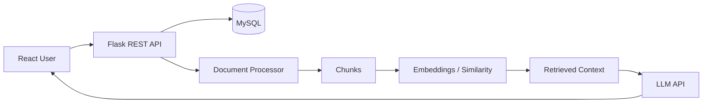

# Architecture

```mermaid
flowchart LR
U[React User]-->A[Flask REST API]
A-->DB[(MySQL)]
A-->P[Document Processor]
P-->C[Chunks]
C-->E[Embeddings / Similarity]
E-->R[Retrieved Context]
R-->L[LLM API]
L-->U
```
Security boundary: JWT identifies a user; every document query is filtered by owner before AI processing.
